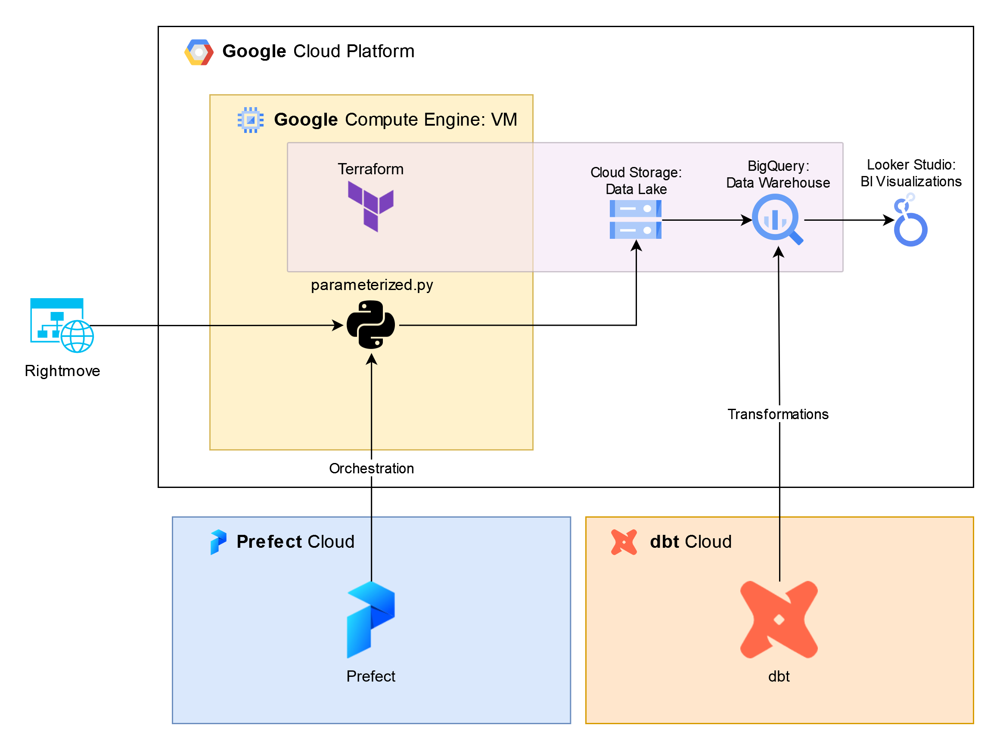
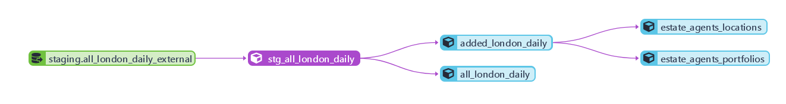

# DataTalksClub 2023 Data Zoomcamp: Capstone

## Index

To make this easier to review, the notes below are organized in the same manner as the [criteria](https://github.com/DataTalksClub/data-engineering-zoomcamp/tree/main/week_7_project#peer-review-criteria). For easy reference, I've included the criteria that I'm aiming for at the top of the explanation.

1. [The Problem](#the-problem)
2. [Cloud Infrastructure](#cloud-infrastructure)
3. [Data Ingestion](#data-ingestion)
4. [Data Warehouse](#data-warehouse)
5. [Transformations](#transformations)
6. [Dashboard](#dashboard)
7. [Reproducibility](#reproducibility)

## The Problem

> Problem is well described and it's clear what the problem the project solves

In the UK, it's suprisingly difficult to get up-to-date statistics on the property market. The data exists, but it's generally either private, extremely delayed, or missing essential information. In particular, **I'd like to know which estate agents are most active in the London market, where they are listing properties, and how much their properties list for**.

Thankfully, property listings inside of the UK are typically placed on two websites: [Rightmove](https://www.rightmove.co.uk/), and [Zoopla](https://www.zoopla.co.uk/). Rightmove is the more popular of the two, and is the main data source for this project.

To capture this data, I built an ETL pipeline based around a web scraper which:
1. Searches for any listings added in the last day
2. Scrapes each page for essential data
3. Orders the data into a dataframe and applies a schema
4. Converts the dataframe into parquet format and uploads it to a data lake in GCP

The pipeline is orchestrated in [Prefect](https://www.prefect.io/), and uses [GCP](https://cloud.google.com/) and [dbt](https://www.getdbt.com/) to further handle downstream data, which is vizualized in [Looker Studio](https://lookerstudio.google.com/s/jI63oxn9v7w).




## Cloud Infrastructure

> The project is developed in the cloud and IaC tools are used

**Terraform, an IaC tool**, is used to initalize the Google Cloud Storage and the BigQuery datasets used in the project, following creation of the VM hosting the project. While I considered running Terraform locally, it would have required additional setup and not substantially shortened VM creation, as we are not using docker in this project.

Terraform files in this project are available at [main.tf](main.tf) and [variables.tf](variables.tf). Usage is further explained in [Setup: Terraform Setup and Services Deploy](/notes/setup.md#terraform-setup-and-services-deploy)

Other cloud-based tools used in this project:

| Resource | Usage |
| - | - |
| Google Compute | Virtual machine used as host for ETL flow |
| Prefect Cloud | Orchestrator for ETL flow, connected via API to a Prefect Agent running on the Google Compute VM |
| Google Cloud Storage | Data Lake, receieves and stores data from ETL flow |
| DBT Cloud | Cloud-based data transformation, used to transform data from GCS into BQ |
| Google BigQuery | Data Warehouse |
| Looker Studio | Data Visualizations |


## Data Ingestion

> Batch: End-to-end pipeline: multiple steps in the DAG, uploading data to data lake

  

Data ingestion is orchestrated using Prefect, and consists of four intermediate tasks within a [main flow](parameterized.py):
  1. A starting URL generated by the function `get_rightmove_url()` is fed into `get_rightmove_results()`, a task which scrapes result pages and returns a list of all property listings found at that URL
  2. In a loop, each URL is fed to `scrape_page()`, which scrapes relevant information from each result and returns a dictionary. These dictionaries are combined into a list of dictionaries.
  3. The list of dictionaries is sent to `clean()`, which combines dictionaries into a Pandas DataFrame and applies a schema provided by [dtypes.yaml](dtypes.yaml) to avoid any parquet errors.
  4. Finally, the dataframe is sent to `save_to_gcp()`, which saves the dataframe in parquet format and uploads it to the Data Lake.


## Data Warehouse

> Tables are partitioned and clustered in a way that makes sense for the upstream queries (with explanation)

All data for this project is warehoused in BigQuery. The warehouse relies on an external table initalized in [BigQuery](/notes/setup.md#bigquery-setup), before [being transformed in DBT](dbt/models/core/all_london_daily.sql). The database is partitioned within BigQuery, not clustered:

| Method | Field/Method | Rationale |
| - | - | - |
| Partioning | Date/Day | Most filtering will occur on the date column. We do not have information on hour, and year is far too wide a net in this implementation.
| Clustering | N/A | As we are handling a small amount of data (< 2 GB), it would not be efficient to cluster this set. Clustering may be set up once a sufficient quantity of data has been collected. |

Partitioning is done via dbt, using the command:
```sql
{{ config(
    materialized='table',
    partition_by={
      "field": "Date",
      "data_type": "DATE",
      "granularity": "day"
    }
)}}
```

## Transformations

> Tranformations are defined with dbt, Spark or similar technologies

Transformations for this project are defined and orchestrated within **dbt**, as per the lineage below. This is scheduled as a job run on a daily basis, several hours after data has been imported.



Transformations:

1. Data is read from the external table [`all_london_external`](notes/setup.md#bigquery-setup) set up in BigQuery, which references all daily parquet files, into the view [`stg_all_london_daily`](dbt/models/staging/stg_all_london_daily.sql).
2. This view is used to create two new tables: [`added_london_daily`](dbt/models/core/added_london_daily.sql), which should consist only of unique results, and [`all_london_daily`](dbt/models/core/all_london_daily.sql), which includes all records.
3. Records from `added_london_daily` are used to create two tables which provide statistics on estate agents: [by portfolio size](dbt/models/core/estate_agents_portfolios.sql), and [by location](dbt/models/core/estate_agents_locations.sql), or outcode.

Of the transformations run, only one can be considered "essential": the `id` column in `all_london_external` is not a unique value, as estate agents may reduce the price of an existing listing, which leaves us with duplicate values for the same property. For a properly updated record, we need to have a method which selects the most recent listing, and removes all others.

This has been accomplished in SQL by using a [window function](https://www.postgresql.org/docs/current/tutorial-window.html) within a [Common Table Expression (CTE)](https://www.postgresql.org/docs/current/queries-with.html) when building [`added_london_daily`](dbt/models/core/added_london_daily.sql): essentially, the query creates temporary table with an added `rnk` column, which ranks entries of the same `id` by date. All columns from this temporary table except `rnk` are selected in a subsequent query, using `WHERE rnk = 1` as a filter for recency.

```sql
WITH recent_rank AS(
  SELECT 
    id,
    ...
    ROW_NUMBER() OVER (PARTITION BY id ORDER BY Date DESC) AS rnk
  FROM {{ ref('stg_all_london_daily') }}
)

SELECT
...
FROM recent_rank
WHERE rnk = 1;
```

## Dashboard

> A dashboard with 2 tiles

The dashboard for this project is set up on Looker Studio and is available [at this link](https://lookerstudio.google.com/s/jI63oxn9v7w).

## Reproducibility

> Instructions are clear, it's easy to run the code, and the code works

**As the above criterion references "the code", I'll only reference *running* the [main ETL script](parameterized.py) here. A full setup guide, including each of the cloud services, is available at [this link](notes/setup.md).**

### Requirements

This project was developed in WSL2 running Debian. The guide below assumes you are running the code in a Debian or Ubuntu environment. Additionally, this program requires a Google Cloud Storage bucket, which can be initalized manually, or through [Terraform](https://developer.hashicorp.com/terraform/tutorials/aws-get-started/install-cli). 

*(To initalize through terraform, update the values in [variables.tf](variables.tf) to include your GCP project name and region, before using [main.tf](main.tf) to build resources.)*

This ETL Script relies on the following dependencies:
- Python 3.9 or higher
- The Python packages listed in [requirements.txt](requirements.txt)
- The YAML file [dtypes.yaml](dtypes.yaml), which lists data types
- The Python file [parameterized.py](parameterized.py), the ETL flow

### Setup

1. You may download the avove requirements individually or clone the entire repository locally. Any Python dependencies can be installed by running `pip install -r requirements.txt` from a terminal window once Python and pip have been installed.
2. Following installation of the required Python Packages, check to ensure that Prefect was installed correctly by running `prefect version`, which should print version and environment details.
3. In a new terminal window, start Prefect Orion with the command `prefect orion start`. Follow the instructions provided by Orion (`prefect config set PREFECT_API_URL=...`) and go to the dashboard via the provided link.
4. From within the Prefect dashboard, select "Blocks". Add a GCP Credentials Block titled "real-estate-data" using the JSON keyfile for your GCP service account. Your service account must have cloud storage permissions.
5. Return to blocks and add a GCS Bucket block titled "real-estate-data". Connect it to a bucket in Google Cloud Storage, and use the credentials added in step 4.
6. In your local machine, run the program with the command `python parameterized.py`. This will create a test run, which will scrape one page of results (24 listings) to the GCS bucket you specified in step 5, in the directory `/rm_data/test/{date}.parquet`.

### Notes

- This script will default with the `is_testrun` variable set to `TRUE`: the ingestion script is *aggressively* rate-limited, and a full run may take well over an hour to complete.
- It is *essential* that this project is rate-limited: too many requests in too short a time will see your IP address blocked, and frankly, isn't a very nice thing to do. I would not recommend reducing any rate-limiting parameters within the main script. These are:
  - A randomized wait between individual page scrapes, which averages to 5 seconds
  - In a full run, a randomized wait at the start of the program, which averages to 15 minutes
  - In a full run, a randomized wait every 100 page scrapes, which averages 50 seconds
